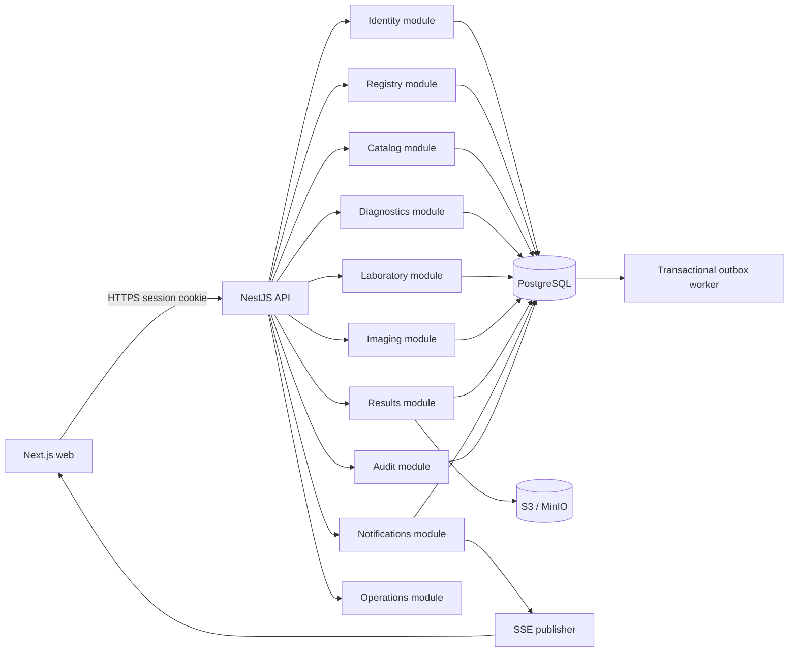

# Architecture

**Knowledge status:** `DECISION` arquitetural proposta e registrada em ADRs; sistema mestre, identity provider e carga permanecem `OPEN QUESTION`.

## 1. Decision summary

`DECISION`: modular monolith, TypeScript, PostgreSQL, S3-compatible storage, SSE and durable outbox. The repository is new; this is a proposed foundation, not a claim that code exists.

### Why modular monolith

- one operational product and small initial team;
- transactional consistency matters for result release/audit/notification intent;
- simple deployment and debugging in a hospital;
- explicit module contracts provide extension without distributed-system overhead;
- later extraction is possible only where measured boundaries and load justify it.

Microservices, Kafka, CQRS/event sourcing, Kubernetes, GraphQL, Redis and Elasticsearch are not MVP defaults. Each requires a concrete problem, owner, operational budget and ADR.

## 2. Logical architecture

## 3. Deployment topology

Development: reverse proxy optional → web/API containers → PostgreSQL → MinIO; worker can run in API process or separate same-image process. Production topology, TLS and secrets are documented in `operations/` and must be approved by TI.

No production deployment is implied by this repository. Separate dev/test/staging/prod credentials and databases are mandatory.

## 4. Integration boundaries

| Future system | Boundary now | Future contract |
| --- | --- | --- |
| ERP/HIS | `ExternalReference`, registry ports | patient/encounter sync with reconciliation |
| Identity provider | `IdentityProvider` port | OIDC/AD provisioning and logout |
| EvolutionAPI/WhatsApp | notification channel adapter | signed, consented, acknowledged delivery |
| PACS/DICOM | imaging attachment/reference port | DICOM study/series IDs, not raw viewer in MVP |
| Analyzer/LIS | lab accession/result import port | idempotent signed import |
| External lab | diagnostic service + integration adapter | status/result contract with source provenance |

The Hub remains source of truth for the operational lifecycle it owns, while external clinical/master data ownership is explicit.

## 5. Data ownership

| Module | Owns | Reads via |
| --- | --- | --- |
| Identity | users, roles, sessions | authorization port |
| Registry | patients, encounters, admissions, external refs | registry query port |
| Catalog | services, capabilities, policies, reasons | catalog port |
| Diagnostics | requests, items, aggregate status | diagnostics port |
| Laboratory | samples/accessions and recollection | lab port |
| Imaging | procedures/schedules | imaging port |
| Results | result versions, components, attachments | result port |
| Notifications | inbox/delivery/ack/outbox consumption | notification port |
| Audit | append-only events/timeline projection | audit port |
| Operations | queue/read projections and metrics | query ports/events |

## 6. Architecture fitness

The first fitness checks are dependency direction, no circular imports, no module writing another module’s tables, transaction tests around release/recollection, and measured queue/search latency. Optimize for a small team and hospital reliability, not millions of users.

## 7. Failure boundaries

- PostgreSQL unavailable: readiness false; no clinical command accepted.
- Object storage unavailable: draft may remain, release requiring attachment blocked; no fake success.
- Outbox worker unavailable: state commit remains durable; notification queue visibly pending and alertable.
- SSE unavailable: API/inbox/polling remain usable; UI shows degraded state.
- External integration unavailable: request can remain with explicit integration/pendência status; do not invent completion.
