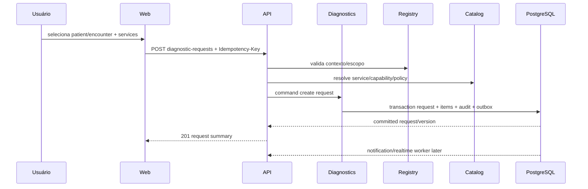
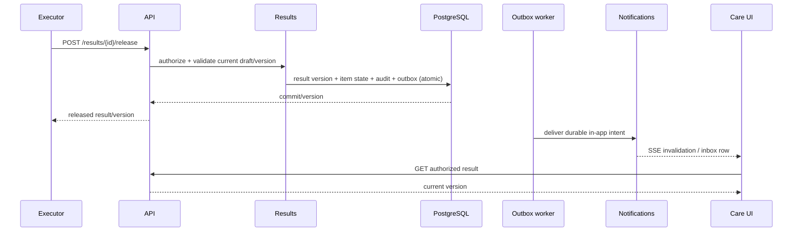

# Data flow

**Knowledge status:** `DECISION` de fluxo esperado; tempos, integrações e ownership reais são `ASSUMPTION`/`OPEN QUESTION` do Discovery.

## 1. Create request



## 2. Result release and notification



## 3. Recollection

Rejection and request of recollection commit sample chain, item exception state, audit and notification intent together. Physical collection is a later event; a missing replacement remains visible in the queue.

## 4. Timeline

Timeline query reads immutable audit/domain events, enriches them with authorized labels/context and paginates by cursor. It must not join unscoped patient data. A projection can improve performance, but the event is the source of truth and projection rebuild is possible.

## 5. File flow

```text
create result draft → upload session → direct object upload → finalize/checksum/MIME/scan → attachment linked to version → release eligibility → authorized temporary download
```

An orphan upload is garbage-collected only after retention/policy allows and with storage audit; it is never mistaken for a released clinical attachment.
