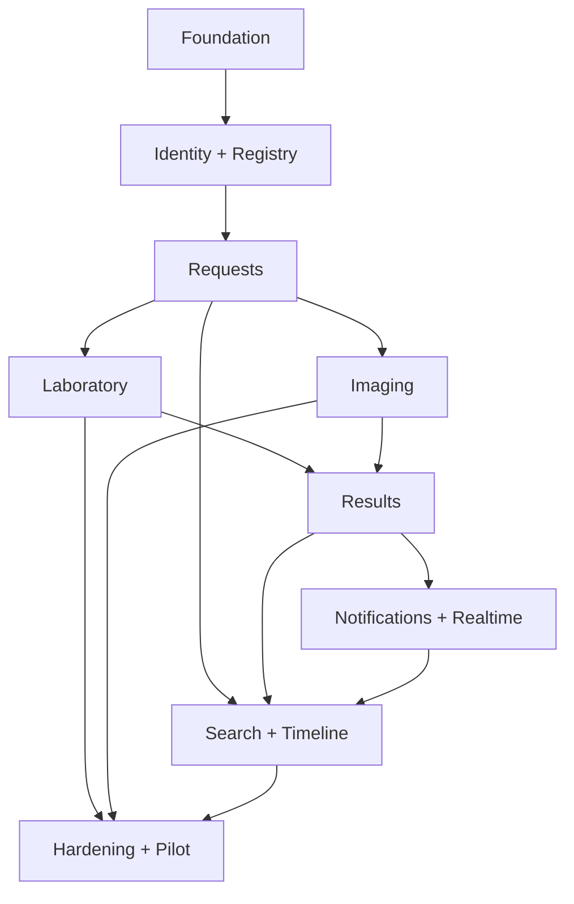

# Build Plan

**Knowledge status:** `DECISION` de ordem de implementação; o plano foi usado como roteiro e agora registra execução, evidência e pendências.

**Status (20/08/2026):** `MVP LOCAL EXECUTABLE; NOT PRODUCTION READY`  
**Pré-condição para piloto:** aprovação do PRD/SPEC e resolução dos gates clínicos/operacionais aplicáveis.

**Rodada 95/100:** a barra operacional atual está em [`QUALITY_SCORECARD_95.md`](QUALITY_SCORECARD_95.md), com execução em [`ROADMAP_95.md`](ROADMAP_95.md) e backlog incremental em [`BACKLOG_95.md`](BACKLOG_95.md). O plano original M0–M8 continua sendo a referência de intenção; a rodada 95/100 fecha lacunas do artefato local e não substitui aprovação hospitalar.

## 0. Implementation status

| Milestone | Status | Evidence | Remaining gate |
| --- | --- | --- | --- |
| M0 Foundation | implemented locally | Next 16 app/proxy, contracts, envelope, health, incremental migrations, seed, lint/typecheck/build | CI execution and approved production configuration |
| M1 Identity/registry | implemented locally | opaque session, scrypt password hash, CSRF, RBAC/scope, patient/encounter/admission reads, safe ADMIN-only user/role administration | hospital IdP, ownership, delegated-manager scope and transfer/alta policy |
| M2 Requests | implemented | multi-item request, protocol sequence, duplicate warning/override, idempotency, audit/outbox | transfer/alta commands remain policy-gated |
| M3 Laboratory | implemented | receive, one-sample/many-item, processing, rejection, recollection/replacement, queue | equipment integration and pilot SLA validation |
| M4 Imaging | implemented | RX direct procedure path, US schedule/reschedule/start/perform, conflict/history | scheduling policy and real modality integration |
| M5 Results/files | implemented locally | draft edit, release/review/amend/void, immutable versions, checksum/MIME/quarantine/private download, local/S3-compatible factory | external AV, production bucket/credentials and critical policy |
| M6 Notifications/realtime | implemented locally; conditional | transactional intents, inbox/ack, leased outbox worker, bounded sink, SSE heartbeat/replay/resync/expiry and UI refetch | approved critical fallback/escalation and production broker/worker topology |
| M7 Operations | implemented locally | scoped search with typed results/filters, cursor lists for requests/timeline, queues/next action, dashboard indicator definitions, bounded metrics and four-route perf smoke | representative hospital load and database query plan review |
| M8 Hardening | implemented locally; conditional | 109 Vitest tests, 95.35% statement coverage, 81.05% branches, PostgreSQL/restore smoke, 24 browser E2E via LAN, explicit accessibility suite 6/6, OpenAPI 47 paths, production perf smoke (400 requests, max p95 434.69 ms), audit/secret scan | object-storage restore, manual accessibility/clinical acceptance, remote CI execution and pilot sign-off |

The implementation is a single Next.js modular monolith under `src/` plus `packages/contracts`; the original `apps/*` ownership in the planning notes is a target boundary, not a claim that those directories exist. The runtime intentionally remains synthetic/local and must not be presented as hospital-approved.

## 1. Build principles

- vertical slices: request → persistence → API → UI → permission → audit → test;
- cada task lê o requisito e SPEC antes de editar;
- nenhum “backend primeiro” que deixe uma tela falsa;
- migrations, fixtures, observability e docs evoluem com a slice;
- cada milestone termina com gauntlet: happy, invalid, unauthorized, duplicate/retry, concurrency, empty/loading/error, mobile/keyboard;
- dependency versions and scripts are now pinned in `package.json`/`package-lock.json`; future dependencies still require security and ownership review.

## 2. Milestones

### M0 — Foundation and contracts

- Objective: criar workspace, env separation, lint/typecheck/test harness, design tokens, API envelope, migration runner e CI.
- Scope: monorepo `apps/web`, `apps/api`, `packages/contracts`, `packages/config`; Docker dev PostgreSQL/MinIO; no clinical feature.
- Dependencies: none; must resolve OQ-012 enough for local auth boundary.
- Database: migration baseline, extension/UUID strategy, audit/outbox/idempotency foundations.
- Backend/frontend: health endpoints, error envelope, app shell, session boundary stubs with real validation.
- Tests/security/observability: CI gates, secret scan, health/error contract, structured logging/correlation.
- Documentation: README setup, ADRs, architecture update.
- Acceptance/DoD: clone → env example → compose → migrations → seed synthetic → tests/lint/typecheck/build; no fake clinical success.

### M1 — Identity, scope and registry context

- Objective: authenticate user, assign roles/scopes and load patient/encounter/admission context.
- Scope: users/roles/departments/sessions; patient/owner/external reference; transfer/alta representation.
- Dependencies: M0; OQ-012, OQ-019.
- Database/API/UI: migrations, auth endpoints, scoped patient search/detail, context picker.
- Tests/security: session, CSRF, wrong-role/scope/IDOR, homonym; synthetic factories.
- Observability/docs: audit role changes, login/security alerts; update permissions/UX.
- Acceptance/DoD: authorized user can open valid context; unauthorized cannot discover it; no product feature bypasses scope.

### M2 — Create diagnostic request (vertical slice)

- Objective: clinician creates multi-item request with protocol, priority, duplicate warning and audit.
- Dependencies: M1 + catalog seed.
- Database/API/UI: services, request/items, code sequence, create endpoint/form/summary.
- Tests: AC-FR-CORE-001-01, 002-01, 004-01; duplicate/concurrency/idempotency.
- Security/ops/docs: server validation, audit/outbox, traceability, queue stub.
- DoD: request survives reload and appears in authorized queue; no hardcoded patient/service; errors recover.

### M3 — Laboratory receive/process/recollect

- Objective: Lab executes sample-based flow including rejection and recollection chain.
- Dependencies: M2; OQ-008 must be decided enough for pilot.
- Database/API/UI: samples, links, reasons, lab queue, receive/start/recollection/replacement commands.
- Tests: normal flow, multiple items/one sample, successive recollection, wrong accession, wrong role, retry/concurrency.
- Security/observability/docs: audit each sample event, queue/SLA metrics, runbook for unavailable equipment.
- DoD: AC-FR-LAB-001-01/003-01 pass with real DB and UI; no orphaned recollection.

### M4 — Imaging workflows

- Objective: RX and US have distinct operational paths; US schedule/rechedule works.
- Dependencies: M2; OQ-009/OQ-010.
- Database/API/UI: procedures/schedules, image queues, report draft states.
- Tests: AC-FR-IMG-002-01, schedule conflict, reschedule history, perform/await report, wrong service role.
- DoD: neither workflow is forced through lab sample states; schedule and execution survive reload.

### M5 — Results, attachments and versioned release

- Objective: draft → release → view/review → amend with secure attachments.
- Dependencies: M3/M4; result schemas and critical policy gate.
- Database/API/UI: results/versions/components/files, upload session/finalize, release/amend/view/review.
- Tests: AC-FR-RESULT-001/002/003, attachment invalid/quarantine, stale review, duplicate release, result completion.
- Security/ops/docs: storage scan, signed downloads, audit/version timeline, backup attachment coverage.
- DoD: released content cannot be silently overwritten; current version/re-review is clear.

### M6 — Notifications, critical policy and realtime

- Objective: durable internal inbox, acknowledgement/escalation and SSE invalidation.
- Dependencies: M5; OQ-005/OQ-018.
- Database/API/UI: notifications/deliveries/ack/outbox, inbox, SSE endpoint/reconnect.
- Tests: normal result notification, critical ack/escalation, worker crash/retry/dedupe, session expiry, network degradation.
- DoD: notification failure is visible, critical is not considered acknowledged by delivery alone, UI refetches state.

### M7 — Search, timeline, queues and dashboards

- Objective: users can find and act without knowing patient; managers see actionable metrics.
- Dependencies: M2–M6.
- Database/API/UI: indexes, cursor search, event-derived timeline, queue filters, dashboard cards.
- Tests: exact/protocol, homonym, unauthorized search, pagination, empty/partial/degraded, EXPLAIN representative data.
- DoD: response budgets are measured; no unbounded list or separate timeline truth.

### M8 — Hardening, accessibility and pilot

- Objective: production-like validation for controlled pilot.
- Dependencies: all prior; OQ clinical/ops gates resolved.
- Scope: full E2E, keyboard/mobile, threat model, performance, backup/restore, observability, release/rollback, training.
- DoD: [`../operations/PRODUCTION_READINESS.md`](../operations/PRODUCTION_READINESS.md) and release checklist pass; pilot owner signs off.

## 3. Dependency graph

## 4. Change management

If BUILD reveals a wrong requirement: update Discovery/decision, PRD, SPEC, tests and implementation in that order. Do not patch only code. Each milestone updates traceability and records a gauntlet round.

## 5. Milestone gate template

For each milestone record: baseline/reproduction, change, raw test evidence, independent critique, largest remaining gap, regression checks, security result, docs updated and decision to continue. A green unit suite alone is not a milestone pass.
