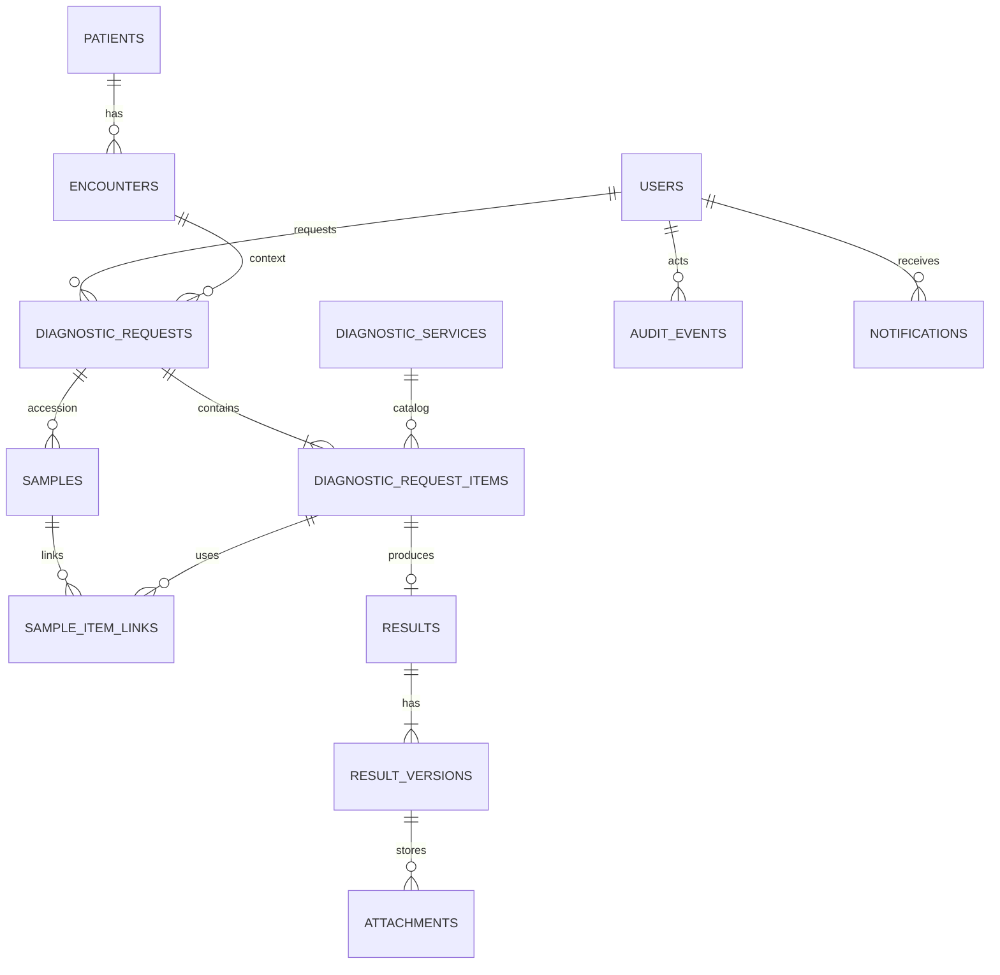

# Data Model

**Knowledge status:** `DECISION` técnica proposta; tipos/campos são contrato de planejamento, não evidência de schema já implantado. Retenção e integrações são `OPEN QUESTION`.

## 1. Conventions

- PostgreSQL; PK técnica UUIDv7 (ou equivalente monotônico aprovado), nunca exposta como única chave humana.
- `created_at`, `updated_at` e eventos são `timestamptz` UTC; timestamps operacionais são nullable quando não aplicáveis.
- Tabelas clínicas não são apagadas fisicamente por usuário comum.
- `version` protege concorrência otimista.
- `status`/`enum` armazenam códigos em inglês; labels são UI.
- Campos JSON só guardam conteúdo de workflow/result schema versionado, não substituem constraints centrais.

## 2. Identity and organization tables

| Table | Fields/meaning | Constraints/indexes |
| --- | --- | --- |
| `users` | id, display_name, email/login, active, timezone, created_at, version | unique normalized login; no secret in profile |
| `roles` | id, code, name, active | unique code |
| `user_roles` | user_id, role_id, department_id?, valid_from/to | unique active assignment; FK |
| `departments` | id, code, name, kind, active | unique code |
| `sessions` | id, user_id, token_hash, created/expires/revoked_at, last_seen | unique token hash; never store raw token |
| `auth_identities` | user_id, provider, subject | unique provider+subject |

## 3. Registry tables

| Table | Fields/meaning | Constraints/indexes |
| --- | --- | --- |
| `patients` | id, display_name, species, breed, sex, birth_date/approx, active, created/updated | indexes normalized display_name/species |
| `owners` | id, display_name, contact fields only as approved, privacy flags | access/retrieval scope; no tutor channel in MVP |
| `patient_owners` | patient_id, owner_id, relation, valid_from/to | FK; current relation constraint |
| `external_references` | entity_type/id, source_system, external_id | unique source_system+entity_type+external_id |
| `encounters` | id, patient_id, source_system, external_id?, type, status, opened/closed_at | patient FK; index active patient |
| `admissions` | id, encounter_id, department/ward/bed snapshot, admitted/discharged_at | history rows for transfers; no overwrite without event |

## 4. Catalog and policy tables

| Table | Fields/meaning | Constraints/indexes |
| --- | --- | --- |
| `diagnostic_services` | id, code, name, category, department_id, workflow_type, capability flags, active | unique code; index active/department/workflow |
| `service_instructions` | service_id, version, text, active_from/to | immutable versions |
| `sla_policies` | id, service_id, priority, calendar, start_event, duration, version, active | unique service+priority+version; policy snapshot on item |
| `critical_result_policies` | id, service_id, definition_ref/config, recipient rule, ack deadline, escalation, version | no hardcoded clinical thresholds; approval metadata |
| `reason_codes` | id, type (`RECOLLECTION`, `CANCEL`, `REJECT`, `AMEND`), code, label, active | unique type+code |

## 5. Diagnostics tables

| Table | Fields/meaning | Constraints/indexes |
| --- | --- | --- |
| `request_code_sequences` | local_date, next_value | PK date; row lock per allocation |
| `diagnostic_requests` | id, request_code, patient_id, encounter_id, admission_id?, requester_id, requesting_department_id, priority, aggregate projection, created/updated, version | unique request_code; FK; indexes patient/encounter/created/status projection |
| `diagnostic_request_items` | id, request_id, service_id, department_id, workflow snapshot, priority, status, reason fields, operational timestamps, due_at/sla fields, version | unique request+service only if policy says; indexes status/department/priority/due/patient via request |

Do not enforce unique request+service blindly: duplicate override can be clinically necessary. Use an active duplicate lookup and explicit audit instead.

## 6. Samples and imaging tables

| Table | Fields/meaning | Constraints/indexes |
| --- | --- | --- |
| `samples` | id, request_id, accession_code, sample_type, status, replaces_sample_id?, collected/received fields, rejection code/note, version | unique accession; FK chain cannot cross request |
| `sample_item_links` | sample_id, item_id, link_status, linked_at/by, rejection details | unique sample+item; check same request |
| `procedures` | id, item_id, workflow_type, status, performed_at/by, metadata JSON schema version | unique active procedure per item |
| `procedure_schedules` | id, procedure_id, starts/ends, resource, status, reason, actor, version | no overlapping active schedule per resource if policy requires |

## 7. Results and files

| Table | Fields/meaning | Constraints/indexes |
| --- | --- | --- |
| `results` | id, item_id, current_version_id, lifecycle_status, needs_re_review, needs_replacement, created/updated, version | unique item_id; FK current version deferred/transactional |
| `result_versions` | id, result_id, sequence, status (`DRAFT`, `RELEASED`, `SUPERSEDED`, `VOIDED`), content JSON, narrative, conclusion, author_id, released_at/by, amendment_reason, supersedes_id, policy/schema version, checksum, created_at | unique result+sequence; immutable after commit |
| `result_components` | version_id, code, value, unit, reference range, abnormal flag, order | unique version+code/order; optional panel detail |
| `attachments` | id, result_version_id, storage_key, safe_name, detected_mime, size, checksum, scan_status, upload status, created_by/at | unique storage_key/checksum as policy; deny public ACL |

## 8. Communication/audit tables

| Table | Fields/meaning | Constraints/indexes |
| --- | --- | --- |
| `notifications` | id, category, priority, recipient_user/team, entity_type/id, deep_link, dedupe_key, state, created_at, expires_at | dedupe unique per event/recipient/version |
| `notification_deliveries` | notification_id, channel (`IN_APP` MVP), status, attempts, last_error, sent/seen_at | unique notification+channel |
| `acknowledgements` | notification_id, result_version_id?, actor_id, acknowledged_at, method | one current acknowledgement per recipient/version; history as audit |
| `audit_events` | id, event_type, actor_id/system, entity_type/id, previous_state, new_state, correlation_id, metadata allowlist, occurred_at | append-only permissions; indexes entity/time/correlation |
| `outbox_messages` | id, event_type, aggregate_type/id, payload, status, attempts, available_at, processed_at, correlation_id | unique event id; worker index status/available |
| `idempotency_keys` | actor_id, scope/endpoint, key, payload_hash, response reference, expires_at | unique actor+scope+key |

## 9. Core constraints

```text
FK: request.patient_id → patients.id
FK: request.encounter_id → encounters.id and encounter.patient_id = request.patient_id (domain/trigger validation)
FK: item.request_id → diagnostic_requests.id
FK: result.item_id → diagnostic_request_items.id (one logical result per item in MVP)
UNIQUE: diagnostic_requests.request_code
UNIQUE: samples.accession_code
UNIQUE: result_versions(result_id, sequence)
CHECK: released_at is not null only for RELEASED/SUPERSEDED version
CHECK: amendment_reason is not null when supersedes_id is not null
CHECK: due_at >= sla_started_at when both exist
```

Cross-row invariants (same request, sample link, current version, state transitions) are enforced in domain transaction plus database FKs/unique/checks where PostgreSQL can express them.

## 10. Core column contract (types/nullability)

`NN` = `NOT NULL`; `NULL` = optional/applicability-dependent. Every table also has `created_at timestamptz NN`; mutable tables have `updated_at timestamptz NN` and `version integer NN`.

| Table | Column | PostgreSQL type | Nullability/key |
| --- | --- | --- | --- |
| `diagnostic_requests` | `id` | `uuid` | PK, NN |
|  | `request_code` | `varchar(20)` | UNIQUE, NN |
|  | `patient_id`, `encounter_id`, `requester_id`, `requesting_department_id` | `uuid` | FK, NN |
|  | `admission_id` | `uuid` | FK, NULL |
|  | `priority` | `varchar/enum` | NN, CHECK |
|  | `aggregate_status` | `varchar/enum` | NN, derived projection |
| `diagnostic_request_items` | `id`, `request_id`, `service_id`, `department_id` | `uuid` | PK/FK, NN |
|  | `status`, `priority`, `workflow_type` | `varchar/enum` | NN, CHECK |
|  | operational timestamps, `sla_started_at`, `due_at`, reason IDs | `timestamptz/uuid` | NULL when not applicable |
| `samples` | `id`, `request_id` | `uuid` | PK/FK, NN |
|  | `accession_code`, `sample_type`, `status` | `varchar/enum` | UNIQUE/NN |
|  | `replaces_sample_id`, rejection code/note | `uuid/varchar/text` | FK/NULL; reason required on rejection |
| `results` | `id`, `item_id` | `uuid` | PK/UNIQUE FK, NN |
|  | `current_version_id` | `uuid` | FK, NN after first release; transactional deferral allowed |
|  | `lifecycle_status`, `needs_re_review` | `varchar/boolean` | NN |
| `result_versions` | `id`, `result_id`, `sequence`, `status` | `uuid/uuid/int/varchar` | PK/FK/UNIQUE/NN |
|  | `content`, `narrative`, `conclusion` | `jsonb/text/text` | content schema NN; optional fields NULL |
|  | author/release/amend/supersedes fields | `uuid/timestamptz/text` | release/ amendment conditional NULL |
| `attachments` | `id`, `result_version_id` | `uuid` | PK/FK, NN |
|  | `storage_key`, `detected_mime`, `checksum`, `scan_status` | `varchar/bytea/varchar/enum` | NN |
|  | `size_bytes`, `uploaded_by`, `uploaded_at` | `bigint/uuid/timestamptz` | NN after finalize; upload draft may be NULL |
| `audit_events` | `id`, event/entity type/id, `occurred_at` | `uuid/varchar/uuid/timestamptz` | PK/NN |
|  | `actor_id`, previous/new state, correlation, metadata | `uuid/varchar/varchar/varchar/jsonb` | actor/system and metadata policy; sensitive payload NULL/allowlisted |

Use `CHECK`, domain validation and conditional indexes for fields whose nullability depends on state. Do not make every future workflow column mandatory in the core.

## 10. Index plan

- exact `request_code`, external ID, accession;
- `diagnostic_request_items(department_id,status,priority,due_at,created_at)`;
- patient/encounter joins and active requests;
- normalized patient/tutor/service/professional search; trigram only if measured;
- audit entity/time and correlation;
- outbox status/available;
- notification recipient/state/created.

Index review must use `EXPLAIN` with representative skew/empty/large cases before release; do not index every column.

## 11. ERD (MVP core)



## 12. Migrations and retention

Schema changes use migrations and expand/contract for destructive changes. Retention durations are `OPEN QUESTION` OQ-013; until approved, production must not configure deletion jobs. Archive/cancel/void preserve audit history and are preferred to silent delete.
