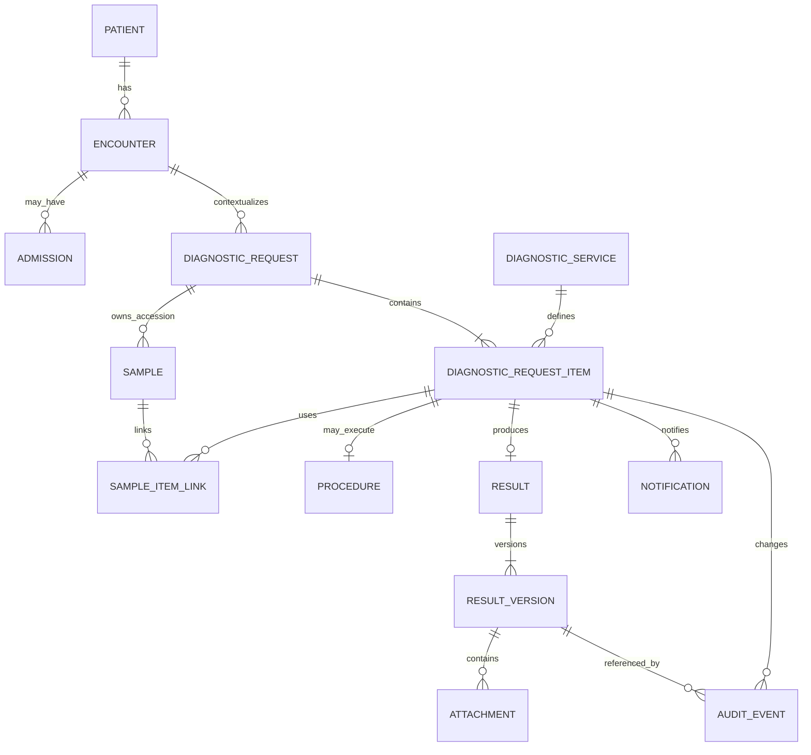

# Domain Model

**Knowledge status:** `DECISION` proposta para BUILD, baseada em `ASSUMPTIONS` do Discovery; accession, ownership clínico e integrações continuam `OPEN QUESTION` onde indicado.

## 1. Bounded contexts internos

| Context | Responsabilidade | Não deve possuir |
| --- | --- | --- |
| Identity | users, roles, sessions, scopes | regras clínicas |
| Registry | patient, owner, encounter, admission, external refs | resultado/estado de diagnóstico |
| Catalog | diagnostic services, workflow capabilities, SLA policies, reasons | execução concreta |
| Diagnostics | requests, items, aggregate status, commands de ciclo | conteúdo de resultado |
| Laboratory | sample/accession, receipt, recollection | autorização global |
| Imaging | procedure, schedule, performance, report workflow | paciente duplicado |
| Results | result, result versions, components, attachments, release/review | agenda clínica |
| Notifications | inbox, deliveries, acknowledgements, escalation | decisão clínica de crítico |
| Audit | immutable audit events e timeline projection | alterações de negócio sem command |
| Operations | queues, SLA projections, metrics | fonte paralela de status |
| Administration | config autorizada | apagar história clínica |

`DECISION`: módulos são limites de código dentro de um deploy, não microserviços. Cada módulo publica ports/commands/events; acesso direto a tabela de outro contexto requer interface documentada.

## 2. Entities and value objects

### Patient / Owner / Encounter / Admission

- `Patient`: `id`, display name, species, breed/sex quando permitido, birth/date approximation, status e external refs.
- `Owner`: pessoa/tutor mínima; dados pessoais sujeitos à política de privacidade.
- `Encounter`: `id`, patient, type, status, opened/closed timestamps, source system.
- `Admission`: período e localização (department/ward/bed) associados a encounter; transferências são eventos.
- `ExternalReference`: `source_system`, `external_id`, `entity_type`, unique por source/entity.

Invariant: request não cruza patient; encounter deve pertencer ao patient; external reference não é confiada como identidade única sem source.

### DiagnosticService and policies

`DiagnosticService` é catálogo configurável: `code`, `name`, `category`, `department`, `workflow_type`, `active`, `requires_sample`, `requires_schedule`, `allows_attachment`, `allows_structured_result`, `instructions`. `SlaPolicy` e `CriticalResultPolicy` são versionadas/configuráveis e referenciadas por item/resultado.

### DiagnosticRequest

Agrega contexto e itens:

- `id` técnico UUIDv7;
- `request_code` humano único;
- `patient_id`, `encounter_id`, optional `admission_id`/location snapshot;
- `requester_id`, `requesting_department_id`;
- `priority` (`ROUTINE`, `URGENT`, `EMERGENCY`);
- `aggregate_status` derivado;
- `created_at`, `updated_at`, `version`.

O request é agrupamento, não o resultado clínico. Cancelamento do request é uma command sobre itens elegíveis.

### DiagnosticRequestItem

Representa um serviço solicitado:

- request/service/department references;
- workflow type snapshot e policy IDs/version;
- item priority (default da request, override autorizado);
- lifecycle state;
- `requested_at`, `received_at`, `started_at`, `performed_at`, `resulted_at`, `released_at`, `reviewed_at`, `completed_at` quando semanticamente aplicáveis;
- `due_at`, `sla_started_at`, `sla_policy_version`, `overdue_at`;
- `version`, `cancellation_reason`, `rejection_reason`.

Não preencher timestamps só para “ter todos”: cada campo representa evento operacional real.

### Sample

Sample/accession pode atender múltiplos itens. Campos: `id`, `request_id`, `accession_code`, `sample_type`, `collected_at/by`, `received_at/by`, `status`, `replaces_sample_id`, rejection reason, version. `sample_item_link` registra item, adequacy/status e timestamps.

### Procedure and schedule

Para workflows de imagem: `Procedure` referencia item e workflow-specific metadata; `ProcedureSchedule` preserva cada reserva/reagendamento com start/end, resource, status, reason e actor. Não é uma agenda clínica geral.

### Result / ResultVersion / Report

`Result` é o agregado lógico por item. `ResultVersion` é snapshot imutável com sequence, content JSON validado, narrative/conclusion, author, release metadata, amendment reason, current/superseded/voided status, `needs_re_review` e `needs_replacement`. `Report` é um tipo de conteúdo narrativo de resultado, não uma cópia paralela. `ResultComponent` é opcional para painéis/analitos sem transformar cada componente em item operacional.

Invariant: depois de release, conteúdo não é editado in-place; amendment cria nova version. Review aponta para uma versão específica.

### Attachment

Attachment pertence à `ResultVersion`, não ao paciente solto. Guarda storage key, safe display name, original name redigido quando necessário, MIME detectado, size, checksum, scan status, uploader e created_at. Acesso passa por autorização do resultado atual/versão.

### Notification / Acknowledgement

Notification é uma intenção/registro para recipient, category, priority, entity deep link, delivery state e dedupe key. `Acknowledgement` registra actor/time/version e é distinto de view/review.

### AuditEvent

Immutable envelope: actor, action, entity_type/id, previous_state, new_state, correlation_id, timestamp server-side, metadata allowlisted, policy/version. Não guardar payload clínico completo sem necessidade.

## 3. Aggregate rules

1. Commands mutam apenas aggregate owner via application port.
2. Cross-context effects usam domain event/outbox, não update direto da tabela alheia.
3. Request/item ownership é estável; resultado não muda de item.
4. Versionamento otimista em aggregates mutáveis.
5. Terminal item não aceita novo trabalho normal.
6. Recollection cria nova sample; não transforma rejection em received retroativamente.
7. Current result version é única por logical result.

## 4. Relationships

## 5. Missing facts carried forward

OQ-005 (policy de crítico), OQ-008 (sample/accession), OQ-009 (agenda), OQ-011 (sistema mestre), OQ-015 (correção) e OQ-016 (result schema) precisam ser resolvidas antes de ativar variantes específicas em produção.
