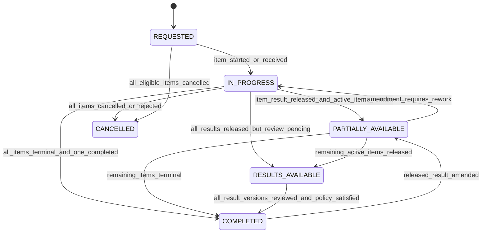
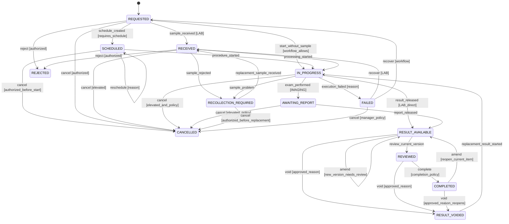
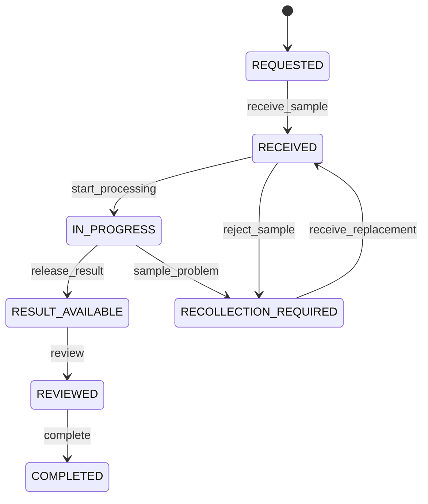
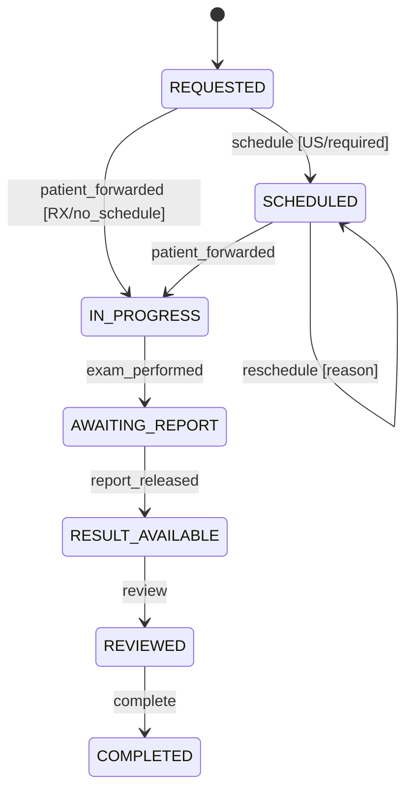
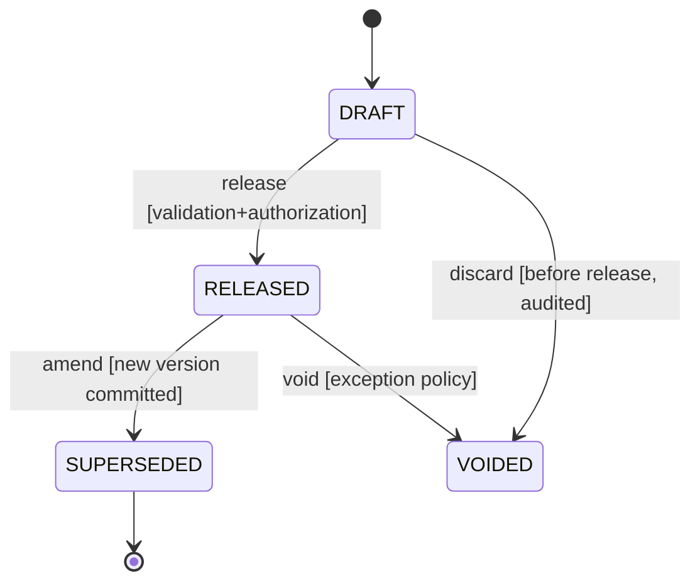
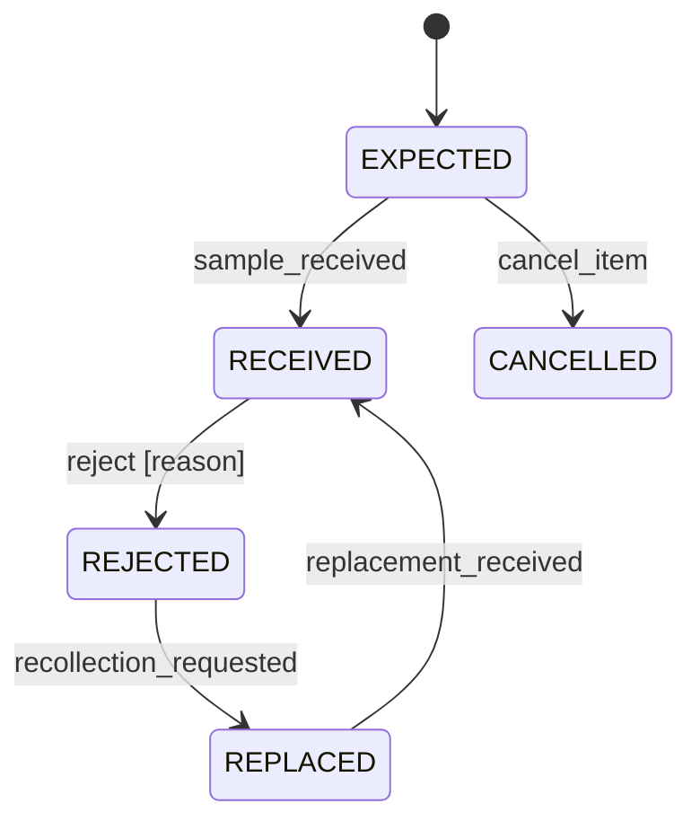
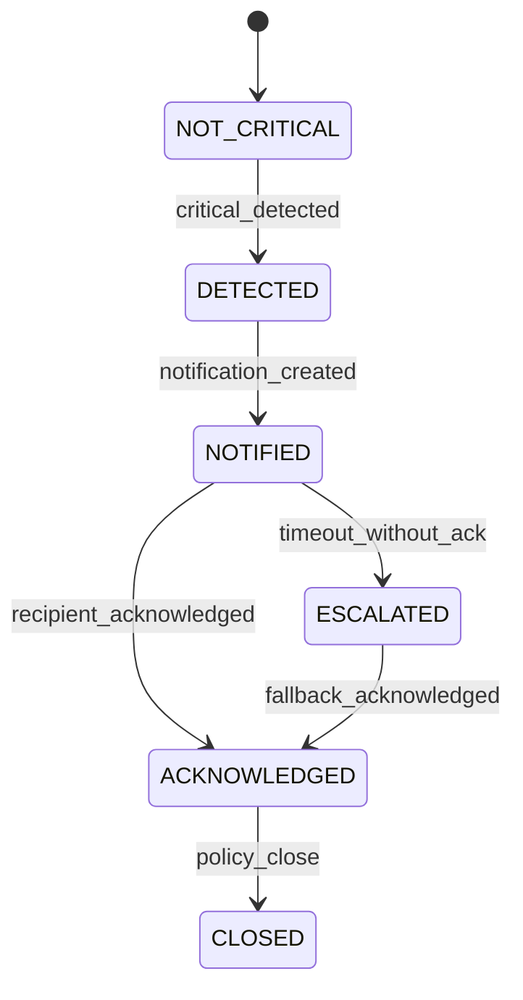

# State machines

**Knowledge status:** `DECISION` de comportamento proposta; a semântica clínica final de revisão, crítico, cancelamento e SLA depende das `OPEN QUESTIONS` referenciadas.

Os diagramas são normativos junto às tabelas de transição. `actor` significa role + escopo, não apenas uma tela que mostra um botão.

## 0. Normalization of supplied labels

The briefing’s candidate labels are intentionally normalized here: `PENDING` is an operational view over `REQUESTED`/`SCHEDULED`/exception states, not a second persisted item state; `RESULT_AVAILABLE` means a result version was released, not merely drafted; `REVIEWED` is distinct from `Viewed` and critical `Acknowledged`; `FAILED` is recoverable until an explicit terminal decision. This avoids a single ambiguous enum carrying lifecycle, SLA and communication semantics.

## 1. DiagnosticRequest aggregate

O status da request é derivado:

Não há `request.completed` manual que ignore itens. `MIXED_TERMINAL` pode ser um filtro/summary, não um estado persistido.

## 2. DiagnosticRequestItem

### Transition contract

| From | Event/command | To | Actor/precondition | Side effects |
| --- | --- | --- | --- | --- |
| request→ | `DiagnosticItemRequested` | `REQUESTED` | requester; service active | audit, SLA start per policy |
| `REQUESTED` | `SampleReceived` | `RECEIVED` | LAB_TECH; sample belongs to request/patient | link sample, timestamp, audit |
| `REQUESTED` | `ProcedureScheduled` | `SCHEDULED` | image team; service requires schedule | schedule history, due_at |
| `RECEIVED/SCHEDULED` | `ProcessingStarted`/`ProcedureStarted` | `IN_PROGRESS` | executor + expected version | audit, started_at |
| `IN_PROGRESS` | `ExamPerformed` | `AWAITING_REPORT` | image team | performed_at, report task |
| `IN_PROGRESS/AWAITING_REPORT` | `ResultReleased` | `RESULT_AVAILABLE` | result owner; valid current draft/version | result version, audit/outbox |
| `RESULT_AVAILABLE` | `ResultViewed` | unchanged | scoped user | view event/record |
| `RESULT_AVAILABLE` | `ResultReviewed` | `REVIEWED` | reviewer; current version was viewed/accessible | review event |
| `REVIEWED` | `RequestItemCompleted` | `COMPLETED` | policy; required review/terminal checks | completed_at |
| `RECEIVED/IN_PROGRESS` | `RecollectionRequested` | `RECOLLECTION_REQUIRED` | lab authorized; reason | new sample intent, notification |
| `SCHEDULED/RECOLLECTION_REQUIRED/FAILED` | `CancelItem` | `CANCELLED` | stage-based permission; reason | audit, notification if needed |
| `AWAITING_REPORT` | `CancelItem` | `CANCELLED` | elevated policy; execution history retained | audit, notification |
| `RESULT_AVAILABLE/REVIEWED/COMPLETED` | `VoidResult` | `RESULT_VOIDED` | manager/result owner; approved reason; current version becomes invalid | prior version `VOIDED`, replacement required, audit + correction notification, prior review/ack remains historical |
| `RESULT_VOIDED` | `CreateReplacementResultDraft` | `IN_PROGRESS` | result owner; item has no valid current result | new draft, new release/review path, aggregate reopens |
| eligible | `RejectItem` | `REJECTED` | executor/manager; reason | audit, notification |
| active | `ExecutionFailed` | `FAILED` | executor; reason | incident/audit, recovery task |
| `RESULT_AVAILABLE/COMPLETED` | `AmendResult` | `RESULT_AVAILABLE` | result owner/manager; reason | new version, invalidate current review, re-notify |

`FAILED`, `RECOLLECTION_REQUIRED`, `SCHEDULED` e `RESULT_VOIDED` não são terminais. `COMPLETED`, `CANCELLED` e `REJECTED` são terminais normais; emenda e void são reaberturas explícitas, nunca sobrescritas silenciosas. No MVP, `ResultReviewed` grava a revisão e, quando não há pendência de acknowledgement/policy, a `CompletionPolicy` emite `RequestItemCompleted` na mesma transação; se uma policy exigir fechamento manual, o endpoint explícito de complete é usado.

## 3. Laboratory workflow

Motivos mínimos configuráveis: `HEMOLYZED`, `INSUFFICIENT_VOLUME`, `CLOTTED`, `MISIDENTIFIED`, `INAPPROPRIATE_MATERIAL`, `OTHER` com observação obrigatória para `OTHER`.

## 4. Imaging workflow

## 5. Result lifecycle/version

O logical `Result` continua apontando para a versão atual `RELEASED`; a versão anterior fica `SUPERSEDED`. Emenda em resultado revisado limpa `needs_re_review` apenas após nova revisão.

## 6. Recollection

Cada substituição referencia `replaces_sample_id`; não se reutiliza accession rejeitado.

O vínculo entre as máquinas é explícito: `SampleRejected`/`RecollectionRequested` grava a amostra como `REJECTED`/`REPLACED` e move cada `DiagnosticRequestItem` afetado para `RECOLLECTION_REQUIRED`; `replacement_received` cria/recebe o novo sample (`EXPECTED → RECEIVED`) e move somente os itens vinculados de volta para `RECEIVED`. Uma amostra rejeitada não pode, sozinha, devolver o item ao processamento.

## 7. Critical result notification

Valores, recipients e timeout são configuração aprovada; o sistema não inventa threshold clínico.
