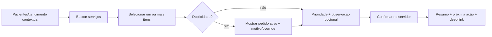

# UX user flows and wireflows

**Knowledge status:** `DECISION/PROPOSAL` de interação, ainda sem implementação ou teste de tarefa real.

## 1. Create request



Primary actions are select, priority and request; context is prefilled. Error/unknown state keeps the user’s typed note locally until server result is known.

## 2. Laboratory queue

```text
Abrir Laboratório → filtros persistidos → item prioritizado → Receber → Iniciar → Resultado draft → Liberar → próxima fila
```

`RECOLLECTION_REQUIRED` branches to reason dialog → notification → replacement sample. No modal for every ordinary transition; confirmation proportional to clinical risk.

## 3. Imaging

```text
Abrir Imagem → queue/agenda → agendar (US) ou encaminhar (RX) → iniciar → realizar → laudo draft → liberar → revisar
```

Reschedule preserves prior slot and reason. Waiting for report is a clear status, not a generic spinner.

## 4. Result/review

```text
Notificação → deep link item → abrir versão atual [view event] → conteúdo/anexos → Revisar [server confirm] → concluído
```

If version changed, show stale conflict and require reopening. `Released`, `Viewed`, `Reviewed`, `Acknowledged` and `Completed` are different labels/actions.

## 5. Critical result

```text
Critical released → inbox high-priority → Open → Acknowledge receipt → Review/clinical action → policy close
                                             ↘ no ack → reminder/escalation queue
```

The interface never claims clinical communication merely because an SSE event was delivered.

## 6. Keyboard flow

Laboratory desktop may support shortcuts for focus/filter/next item, but every action remains reachable by standard keyboard and has visible focus. Shortcuts cannot bypass confirmation/authorization.
